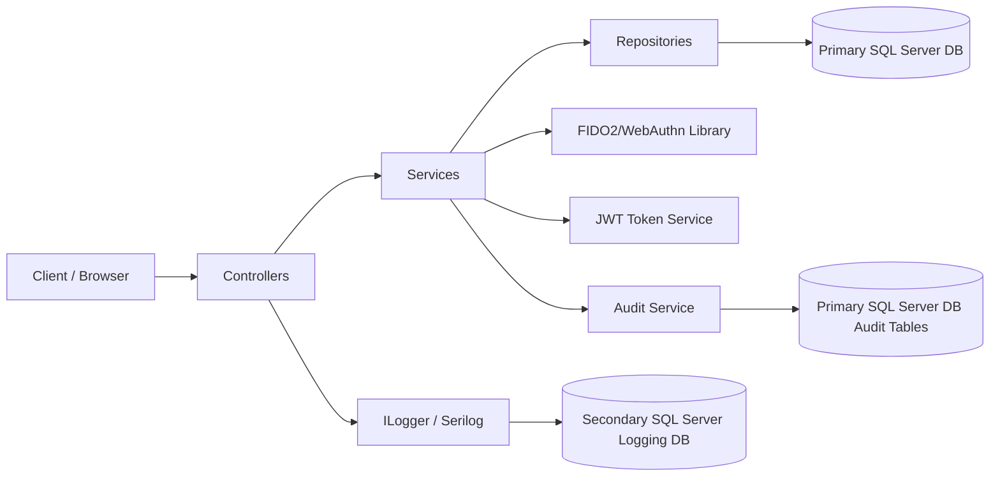

# Architecture

This document describes the high-level design of the Authentication Fido2 API.

## Overview

The application follows a layered architecture with clear separation between API endpoints, service logic, repositories, and persistence.

## Layers

### 1. Presentation layer

The controllers expose HTTP endpoints for:

- Authentication
- FIDO2 enrollment
- FIDO2 login

Key files:

- Controllers/AuthController.cs
- Controllers/Fido2Controller.cs

### 2. Application layer

The service layer contains business rules and orchestrates operations such as:

- user login validation
- FIDO2 challenge generation
- FIDO2 attestation/assertion handling
- token creation

Key files:

- Services/Implementatons/AuthService.cs
- Services/Implementatons/Fido2MfaService.cs
- Services/Implementatons/TokenService.cs

### 3. Data access layer

Repositories abstract data access from the services and interact with Entity Framework Core.

Key responsibilities:

- load users by username, email, or ID
- store and update FIDO2 credentials
- manage FIDO2 transaction state

### 4. Persistence layer

Entity Framework Core is configured in the application startup and uses SQL Server.

Key files:

- Data/ApplicationDbContext.cs
- Data/Configurations/*.cs
- Migrations/

### 5. Observability and audit layer

The system uses two complementary logging paths:

- Application diagnostics logging:
    - Uses ILogger with Serilog sink to SQL Server.
    - Stores request and application logs in a secondary database table dbo.ApplicationLogs.
    - Environment-based level policy: Development verbose, Production errors only.

- Security and authentication auditing:
    - Uses explicit EF entities and writes through IAuditService.
    - Stores domain-level audit events in AuthenticationAuditEvents and SecurityAuditEvents.
    - Designed for pentesting evidence and security investigations.

## Domain entities

### User

Represents an application user with authentication state and MFA configuration.

### UserFido2Credential

Stores the WebAuthn credential details for a user, including:

- credential ID
- public key
- signature counter
- user handle

### Fido2Transaction

Tracks temporary FIDO2 registration and login challenges, including expiry and usage state.

## Result pattern

A shared Result wrapper sits between the service layer and the API layer. This keeps business logic explicit and makes it easier to return both domain data and HTTP-oriented outcomes without scattering error handling across controllers.

Response payload generation is centralized in Common/Result.cs so controllers produce a consistent API envelope:

- Success payload includes success, message, and data.
- Failure payload includes success and message.

The pattern is used for:

- authentication outcomes
- FIDO2 enrollment and login flows
- validation failures and authorization errors

## Authentication flow

### Standard login

1. The client sends credentials to the auth endpoint.
2. The auth service validates the user.
3. If MFA is disabled, the API returns JWT tokens.
4. If MFA is enabled, the API returns a response requiring FIDO2 verification.

### FIDO2 enrollment

1. The client requests enrollment options from the protected endpoint.
2. The service creates a WebAuthn challenge and stores it in a transaction record.
3. The client completes attestation with the authenticator.
4. The service validates the response and stores the credential.

### FIDO2 login

1. The client submits a username or email to begin login.
2. The service creates an assertion challenge.
3. The authenticator signs the challenge.
4. The service validates the signature and returns JWT tokens.

## Dependency injection

Application services are registered in the service collection extension:

- Extensions/ServiceCollectionExtensions.cs

Current DI setup includes:

- Auth and token services
- FIDO2 service
- Audit service
- User, credential, and transaction repositories
- HttpContext accessor for request metadata enrichment in auditing

This keeps startup wiring centralized and makes the application easier to extend.

## Configuration concerns

The application uses configuration sections for:

- database connection string
- logging database connection string
- JWT authentication
- MFA JWT settings
- FIDO2 server settings

## Design notes

- The API is intentionally simple and focused on authentication rather than a large domain model.
- FIDO2 transactions are persisted so challenges can be validated safely over multiple steps.
- Controllers remain thin and delegate business flow to services.
