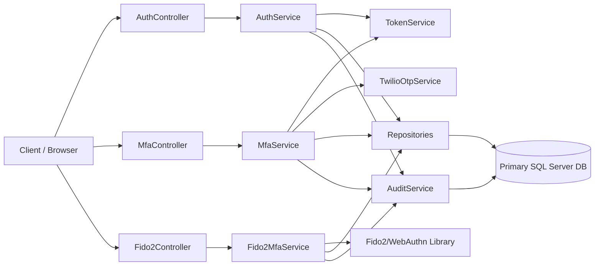

# Architecture

This document describes the high-level design of the Authentication Fido2 REST API.

## Overview

The API uses a layered architecture with controllers, services, repositories, and SQL Server persistence.

## Layers

## 1. Presentation Layer

Controllers expose REST endpoints for:

- password login
- MFA methods and challenge orchestration
- SMS/Email enrollment
- FIDO2 enrollment
- FIDO2 login

Key files:

- Controllers/AuthController.cs
- Controllers/MfaController.cs
- Controllers/Fido2Controller.cs

## 2. Application Layer

Services implement business workflows:

- AuthService: password validation and MFA-gated login decisions
- MfaService: MFA method resolution, OTP challenge start/verify, enrollment start/verify
- Fido2MfaService: WebAuthn registration and assertion workflows
- TokenService: full access token, refresh token, and temporary MFA token issuance
- TwilioOtpService: Twilio Verify integration for sms/email OTP

Key files:

- Services/Implementatons/AuthService.cs
- Services/Implementatons/MfaService.cs
- Services/Implementatons/Fido2MfaService.cs
- Services/Implementatons/TokenService.cs
- Services/Implementatons/TwilioOtpService.cs

## 3. Data Access Layer

Repositories abstract EF Core access for users, credentials, transactions, methods, and challenges.

Key responsibilities:

- user lookup and updates
- FIDO2 credential persistence
- FIDO2 transaction persistence
- MFA method registry access
- MFA challenge lifecycle persistence

## 4. Persistence Layer

EF Core maps entities and migrations to SQL Server.

Key files:

- Data/ApplicationDbContext.cs
- Data/Configurations/*.cs
- Migrations/

## 5. Observability and Audit Layer

Security/authentication auditing is implemented through explicit audit records written by AuditService.

- Tables: AuthenticationAuditEvents, SecurityAuditEvents
- Coverage includes login, logout, MFA challenge and enrollment flows, public user creation, and security-relevant read paths such as MFA method discovery.

## Domain entities

- User: account identity and status
- UserFido2Credential: stored WebAuthn credentials
- Fido2Transaction: FIDO2 challenge transactions
- UserMfaMethod: per-user MFA methods and verification state
- MfaChallenge: MFA login/enrollment challenge lifecycle
- AuthenticationAuditEvent / SecurityAuditEvent: audit trails

## Token Model

- Full access token:
  - Used for authenticated API operations
  - Issued when MFA is not required or after MFA completes

- MFA token:
  - Temporary token issued only when login requires MFA
  - Bound to mfa transaction claim and validated on MFA challenge endpoints

## Authentication Flows

## Standard Login

1. Client calls /api/sessions with username/password.
2. If no MFA methods are enabled, full access token is returned.
3. If MFA is required, response includes:
   - AllowedMfaMethods
   - MfaTransactionId
   - MfaToken
4. Client completes MFA to receive full access token.
5. Challenge endpoints resolve transaction context from the MFA token claims and session state, not from request-body transaction identifiers.

## SMS/Email Enrollment

1. Authenticated user starts enrollment (`POST /api/mfa/enrollments`).
2. Service creates enrollment challenge and sends OTP via Twilio Verify.
3. User verifies OTP (`PATCH /api/mfa/enrollments/current`).
4. UserMfaMethod is inserted/updated as enabled and verified.

## SMS/Email MFA Login Challenge

1. Client starts challenge with MFA token (`POST /api/mfa/challenges`).
2. Client verifies OTP with MFA token (`PATCH /api/mfa/challenges/current`).
3. MFA transaction context is resolved from token claims (`mfa_tx`) and active token session, not from request body.
4. Service returns full access token on success.

## Current API Shape

- Login returns `AllowedMfaMethods` and `MfaToken` when MFA is required.
- SMS and email challenge requests do not send `mfaTransactionId` in the body.
- FIDO2 login continues to use the MFA token and token-session validation.
- Recovery codes are emitted only once inside the enrollment completion response and are not exposed through later read/regenerate APIs.

## FIDO2 Enrollment/Login

FIDO2 flows remain available through Fido2Controller and Fido2MfaService.

FIDO2 enrollment completion is validated against the authenticated user that created the transaction, so enrollment cannot be completed from a different account context.

## Configuration sections

- ConnectionStrings: DefaultConnection
- Jwt
- MfaJwt
- Fido2
- Twilio

## Design notes

- Controllers are thin and delegate to services.
- MFA method combinations are modeled in UserMfaMethods.
- MFA challenge state is explicit and auditable.
- Result wrapper provides a consistent API response envelope.
