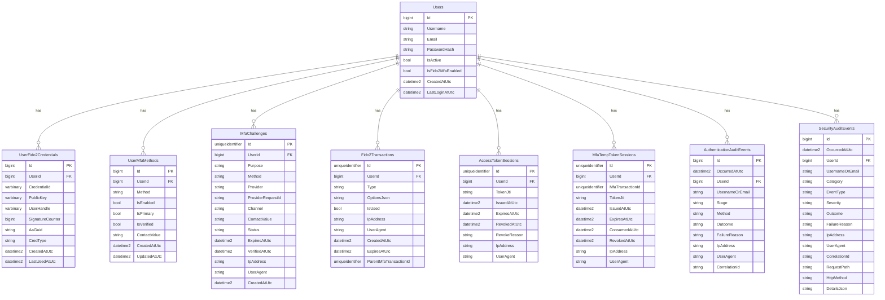

# Database Schema Reference

This document describes the current SQL Server schema used by the Authentication Fido2 REST API.

## Scope

The schema covers:

- user accounts
- MFA method registry and MFA challenges
- FIDO2 credentials and transactions
- access token and MFA temp token session tracking
- authentication and security audit events

## Database Diagram

The diagram below shows the logical model used by the API. In the current implementation, only `UserFido2Credentials` has an enforced foreign key to `Users`; the other relationships are modeled by application logic and indexes.

## Table Summary

### Users

Primary user table.

- `Username` and `Email` are unique.
- `PasswordHash` stores the authentication secret for login.
- `IsFido2MfaEnabled` remains for backward-compatible transition support.

### UserFido2Credentials

Stores WebAuthn/FIDO2 credentials.

- `CredentialId` is unique.
- `UserId` points to the owning user.

### UserMfaMethods

Stores enabled MFA methods per user.

- `Method` values: `sms`, `email`, `fido2`.
- Unique constraint on `(UserId, Method)`.

### MfaChallenges

Tracks MFA challenge lifecycle for login and enrollment.

- `Purpose` identifies the flow, such as login or enrollment.
- `ProviderRequestId` stores the external provider reference when present.
- Indexed by user, purpose, status, and expiration for fast validation.

### Fido2Transactions

Stores FIDO2 registration and assertion transactions.

- `Type` values are `registration` or `assertion`.
- `ParentMfaTransactionId` links FIDO2 login work to the parent MFA transaction.

### AccessTokenSessions

Tracks access-token JWT sessions by `jti` for revocation and replay protection.

### MfaTempTokenSessions

Tracks short-lived MFA JWT sessions by `jti`.

- One row is created per MFA login transaction.
- The row is consumed or revoked when the MFA step completes.

### AuthenticationAuditEvents

Audit trail for authentication-specific events.

### SecurityAuditEvents

Audit trail for broader security-relevant events.

## SQL Script

The canonical schema script is stored in [DATABASE_SCHEMA.sql](./DATABASE_SCHEMA.sql).

## Notes

- The current implementation uses SQL Server and EF Core migrations as the source of truth.
- This document reflects the implemented schema, including the token-session tables and OWASP audit tables.
- The SQL script is a recreate-style reference script for local documentation and review.
- The seed row shown in the SQL script matches the current development seed used by the project.
- If you add a new table or column, update the migration history and regenerate this document.