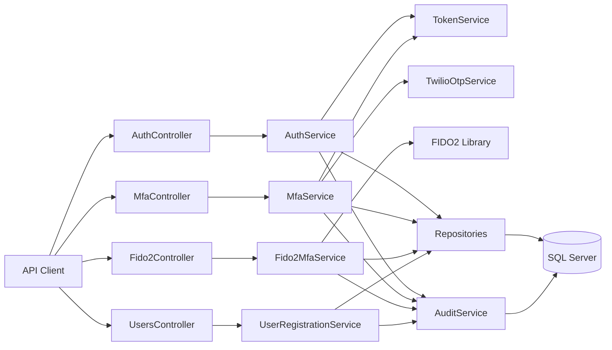
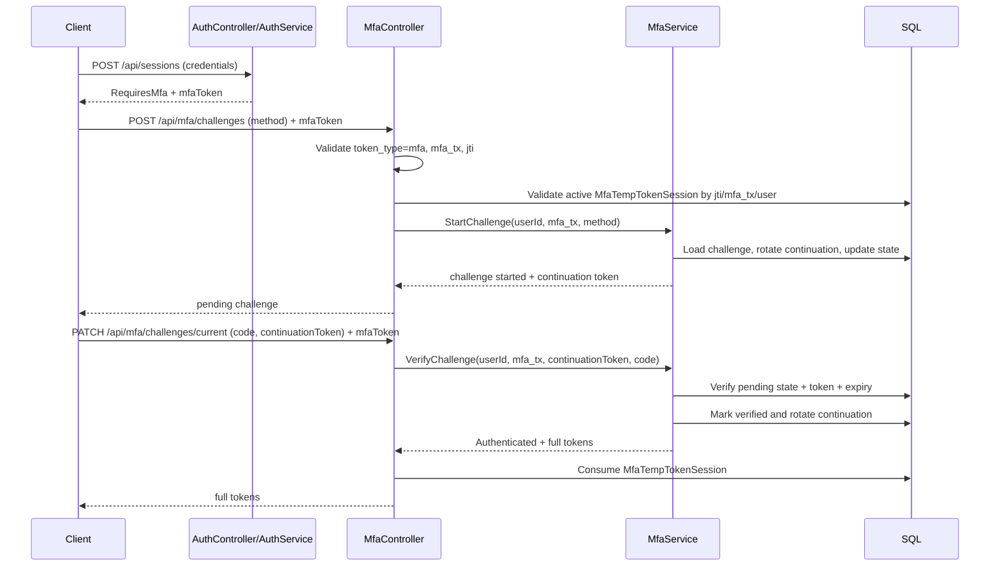
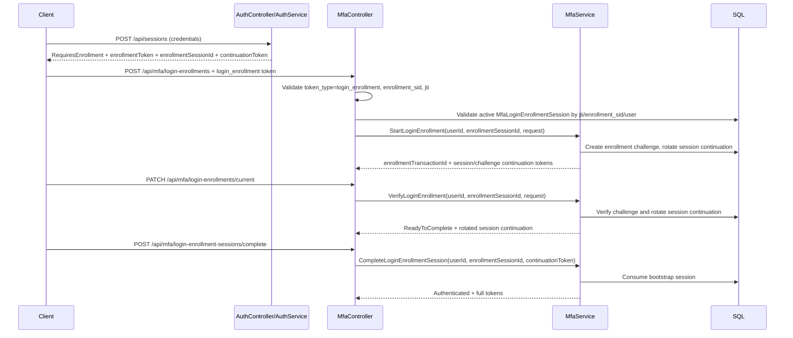
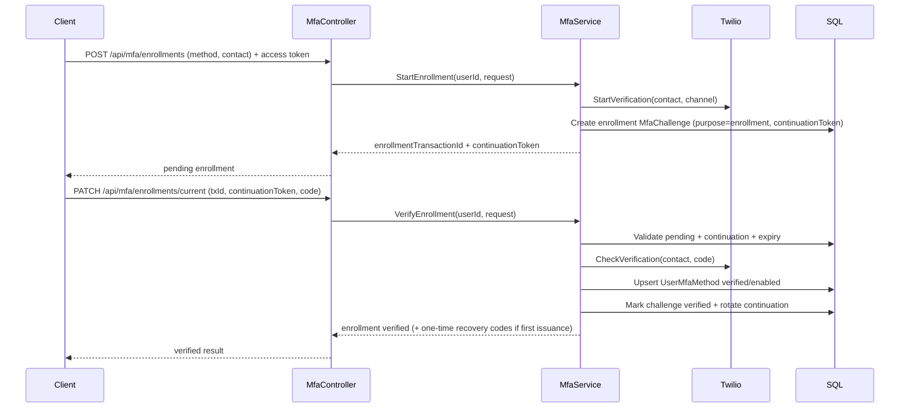
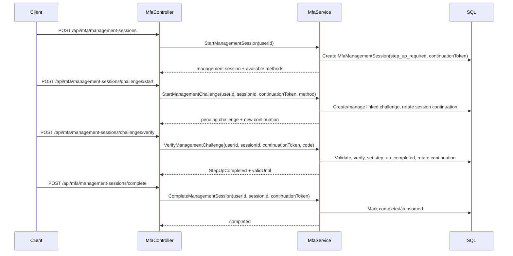

# Final Backend Technical Documentation

## 1. Purpose and Scope

This document consolidates backend documentation into a single source for:

- System architecture
- Technology stack
- SQL/data architecture
- MFA orchestration with emphasis on MfaController flows
- Security and OWASP-aligned controls

Out of scope:

- Any UI or frontend behavior

## 2. System Overview

Authentication.Fido2 is an ASP.NET Core API that provides:

- Username/email + password authentication
- MFA with sms, email, recovery_code, and FIDO2/WebAuthn
- MFA temporary token and full access-token session lifecycle
- Management step-up for sensitive MFA operations
- Recovery code issuance/consumption
- Security and authentication audit trails

## 3. Technology Stack

### Runtime and Framework

- .NET 10 (`net10.0`)
- ASP.NET Core Web API
- JWT Bearer Authentication

### Persistence

- EF Core 10
- SQL Server
- Code-first migrations

### Security and MFA Integrations

- FIDO2 / WebAuthn (`Fido2`, `Fido2.AspNet`)
- Twilio Verify (`Twilio`)

### API and Tooling

- Swagger/OpenAPI (`Swashbuckle.AspNetCore`)

## 4. Backend Architecture

### Layering

- Controllers: HTTP contract, token context extraction, response mapping
- Services: authentication and MFA business logic, anti-replay, state transitions
- Repositories: persistence abstraction over EF Core
- Data layer: `ApplicationDbContext`, entity configurations, migrations
- Audit layer: centralized security/authentication event recording

## 5. SQL/Data Architecture (Current)

Current persistence model is defined by EF entities and migrations.

### Core Tables

- `Users`
- `UserFido2Credentials`
- `UserMfaMethods`
- `MfaChallenges`
- `MfaLoginEnrollmentSessions`
- `MfaManagementSessions`
- `MfaTempTokenSessions`
- `AccessTokenSessions`
- `Fido2Transactions`
- `UserRecoveryCodeBatches`
- `UserRecoveryCodes`
- `AuthenticationAuditEvents`
- `SecurityAuditEvents`

### Key MFA Schema Characteristics

`MfaChallenges`:

- Includes `Purpose`, `Status`, `ExpiresAtUtc`
- Includes continuation control fields:
  - `ContinuationToken` (indexed)
  - `StepVersion`
- Supports challenge metadata: method/provider/channel/contact

`MfaLoginEnrollmentSessions`:

- Dedicated bootstrap session for login-time MFA enrollment before full authentication is granted
- Includes:
  - `Status`
  - `ContinuationToken` (indexed)
  - `StepVersion`
  - `TokenJti` (unique)
  - `ChallengeId`
  - `ExpiresAtUtc`, `CompletedAtUtc`

`MfaManagementSessions`:

- Dedicated step-up session model for sensitive operations
- Includes:
  - `Status`
  - `ContinuationToken` (indexed)
  - `StepVersion`
  - `ChallengeId`
  - `ExpiresAtUtc`, `VerifiedAtUtc`

`UserRecoveryCodeBatches` and `UserRecoveryCodes`:

- Recovery codes stored hashed only (`CodeHash`)
- One-time use tracked by `UsedAtUtc`
- Batch rotation tracked by `ReplacedAtUtc`

### Notes on SQL Script vs Runtime Schema

`Docs/DATABASE_SCHEMA.sql` is a helpful baseline but does not include all recent MFA evolution (for example management sessions and continuation-token/step-version additions in challenge/session flows). The source of truth is:

1. EF entities/configurations
2. migrations history
3. `ApplicationDbContextModelSnapshot`

## 6. Token and Session Model

### Full Access Token

- Used for authenticated operations
- Backed by `AccessTokenSessions` for revocation control (`jti`)

### MFA Temporary Token

- Issued when login requires MFA
- Carries `token_type = mfa`, `mfa_tx`, and `jti`
- Validated against `MfaTempTokenSessions`

### Login Enrollment Token

- Issued when login requires MFA setup before authentication can complete
- Carries `token_type = login_enrollment`, `enrollment_sid`, and `jti`
- Validated against `MfaLoginEnrollmentSessions`
- Cannot be used as a full access token or as an MFA login challenge token

### Continuation Token (Flow Progression)

- Used to prevent replay and enforce ordered flow progression
- Rotated by server as flow advances
- Stored in:
  - `MfaChallenges.ContinuationToken`
  - `MfaManagementSessions.ContinuationToken`
- Generated with cryptographically secure random bytes (256-bit, URL-safe)

## 7. MfaController API Surface (Backend)

### Discovery / Setup

- `GET /api/mfa/methods`
- `GET /api/mfa/setup-options`

### Login Enrollment Bootstrap (login enrollment token required)

- `POST /api/mfa/login-enrollments`
- `PATCH /api/mfa/login-enrollments/current`
- `POST /api/mfa/login-enrollment-sessions/complete`

### Login Challenge (MFA token required)

- `POST /api/mfa/challenges`
- `PATCH /api/mfa/challenges/current`

### Enrollment After Management Step-Up (full access token + recent step-up required)

- `POST /api/mfa/enrollments`
- `PATCH /api/mfa/enrollments/current`

### Management Step-Up Session (full access token required)

- `POST /api/mfa/management-sessions`
- `POST /api/mfa/management-sessions/challenges/start`
- `POST /api/mfa/management-sessions/challenges/verify`
- `POST /api/mfa/management-sessions/complete`
- `DELETE /api/mfa/management-sessions/{mfaTransactionId}`

### Sensitive MFA Method Management (gated by recent step-up)

- `DELETE /api/mfa/methods/{method}`
- `POST /api/mfa/methods/{method}/reconfigure`
- `PATCH /api/mfa/methods/{method}/reconfigure/current`

## 8. MfaController Flow Details

### 8.1 Login Challenge Flow (sms/email/recovery_code)

Flow protections:

- MFA token claim binding (`mfa_tx`, `jti`, `sub`)
- Anti-replay using continuation token + status transitions
- Conflict on replay/advanced state: `409`
- Expired challenge semantics: `410`

### 8.2 Login-Time Enrollment Bootstrap Flow

Flow protections:

- No full access token before explicit bootstrap completion
- Dedicated least-privilege bootstrap token
- Rotating continuation token on each step
- Replay/advanced state conflict: `409`
- Expired bootstrap session: `410`

### 8.3 Enrollment Flow (sms/email)

Flow protections:

- Full access token required
- Recent management step-up required
- Continuation token required for verify
- Replay/advanced state conflict: `409`
- Expired enrollment challenge: `410`

### 8.4 Management Step-Up Flow (for sensitive operations)

Used as prerequisite for:

- MFA method removal
- MFA method reconfiguration

## 9. Error Semantics and ProblemDetails

MfaController normalizes critical errors to `ProblemDetails` for:

- `409 Conflict`
- `410 Gone`
- `429 Too Many Requests`
- `503 Service Unavailable`

Additional behavior:

- `429` includes `Retry-After` header from policy (`MfaApiPolicyOptions.RetryAfterSecondsOnTooManyRequests`)
- Error code may be present in `ProblemDetails.Extensions["code"]`

## 10. Security and OWASP Alignment

### Implemented Controls

- MFA-token claim/session binding for challenge endpoints
- Continuation token rotation and step-based anti-replay semantics
- Expiry handling (`410`) for stale challenge/enrollment operations
- Step-up management sessions for sensitive MFA changes
- Recovery codes hashed at rest and consumed one-time
- Centralized audit event writing for authentication and security events
- Generic failure patterns for sensitive checks

### Operational Hardening Guidance

- Enforce rate limiting across login/challenge/enrollment/public registration
- Maintain secret storage in secure providers (not plain config in production)
- Keep strict HTTPS and FIDO2 origin restrictions
- Keep audit retention, archival, and alerting policies

## 11. Configuration Model

Primary configuration sections:

- `ConnectionStrings:DefaultConnection`
- `Jwt`
- `MfaJwt`
- `MfaApiPolicy`
- `Fido2`
- `Twilio`

## 12. Source References Consolidated

This document consolidates and supersedes fragmented backend guidance from:

- `Docs/README.md`
- `Docs/ARCHITECTURE.md`
- `Docs/DATABASE_SCHEMA.md`
- `Docs/DATABASE_SCHEMA.sql`
- `Docs/API_ENDPOINT_FLOW_GUIDE.md`
- `Docs/MFA_ENROLLMENT_GUIDE.md`
- `Docs/MFA_RECOVERY_CODES_AND_RECONFIGURATION_PLAN.md`
- `Docs/TWILIO_MFA_IMPLEMENTATION_PLAN.md`
- `Docs/OWASP_AUDIT_PLAN.md`
- `Docs/OWASP_PEN_TEST_CHECKLIST.md`
- `Docs/PENETRATION_HARDENING_TOKEN_DRIVEN_PLAN.md`
- `Docs/MFA_FIDO2_EXECUTION_PLAN.md`
- `Docs/MFA_TWILIO_OWASP_CHANGE_EVALUATION_PLAN.md`
- `Docs/MFA_TWILIO_OWASP_GAP_MATRIX.md`
- `Docs/MFA_TWILIO_OWASP_IMPLEMENTATION_ROADMAP.md`
- `Docs/MFA_TWILIO_OWASP_PROGRESS_PLAN.md`

## 13. Canonical Position

For backend architecture and behavior, use this document as the single canonical reference.
When conflicts appear between legacy docs and runtime code, runtime code and migrations are authoritative.
