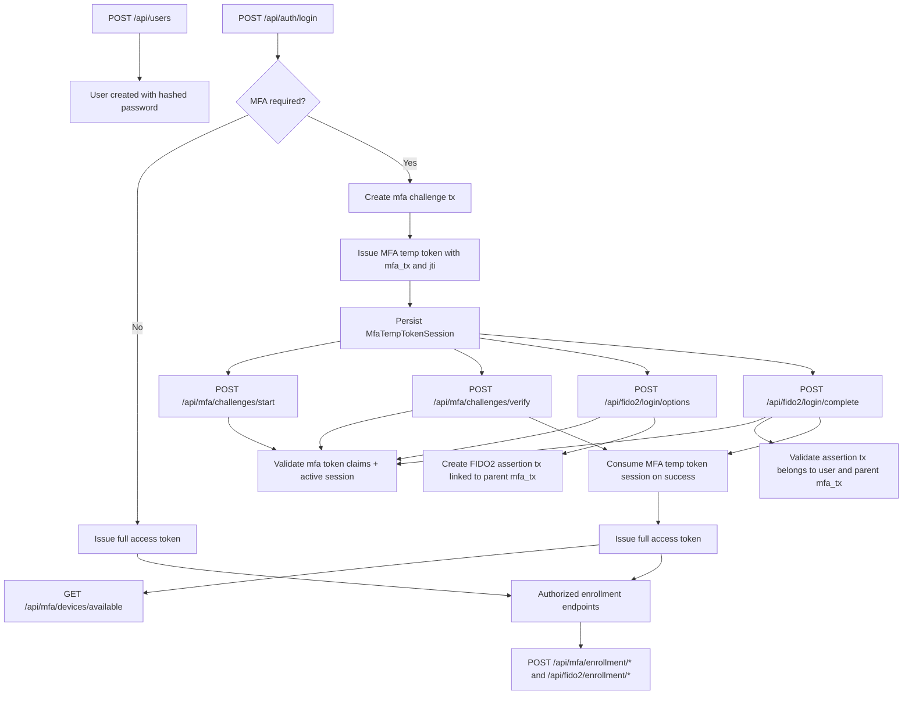

# MFA and FIDO2 Execution Plan

## Goal

Implement a secure authentication flow where:

- Public user registration is allowed.
- Password login returns an MFA temporary token when MFA is required.
- MFA challenge endpoints and FIDO2 login endpoints require the MFA temporary token.
- SMS/Email challenge payload no longer sends mfaTransactionId; transaction context is token-driven.
- Enrollment endpoints remain protected by full access token.
- OWASP-aligned auditing is captured for critical steps.

## Implemented scope

1. Public user creation endpoint.
2. MFA temp token session schema to support token lifecycle checks.
3. MFA challenge endpoints validate MFA temp token claims plus active token session.
4. FIDO2 login options and completion require MFA temp token.
5. FIDO2 assertion transaction is linked to the parent MFA transaction.
6. Password hashing for newly created users (with backward-compatible login verification).

## Flow

## OWASP notes applied

- Short-lived MFA token with transaction binding.
- Replay resistance by consuming token sessions on successful verification.
- Context checks: user id, token type, jti, and transaction id matching.
- Token-driven OTP challenge context: mfa_tx is resolved server-side from MFA token claims.
- Audit events emitted for user creation, MFA, and FIDO2 operations.
- Password storage moved to PBKDF2 hash format for new users.

## Next hardening steps

1. Add rate limiting and CAPTCHA for public user creation.
2. Add token revocation endpoint for active MFA temp sessions.
3. Add integration tests for invalid/expired/consumed MFA token behavior.
4. Add unique constraints and retention jobs for audit growth and archival.
